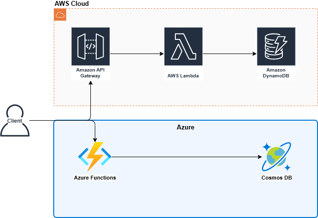
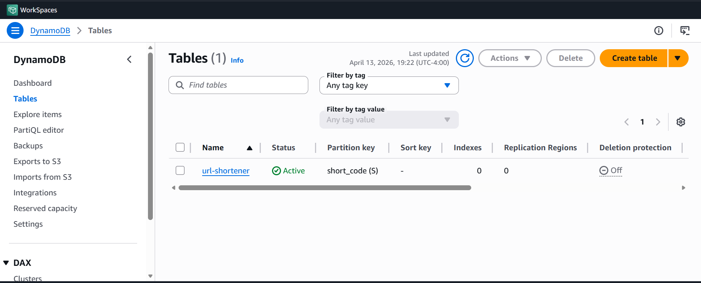
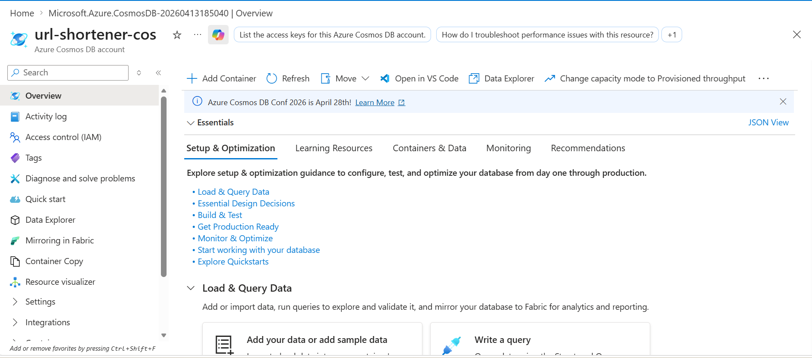
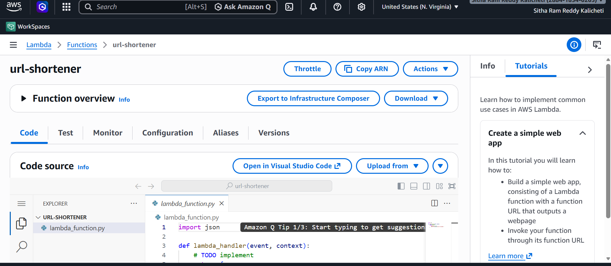
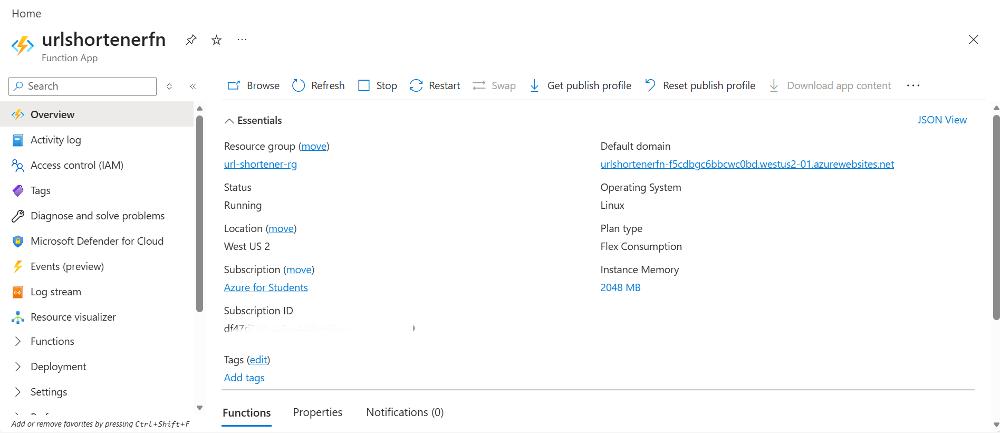
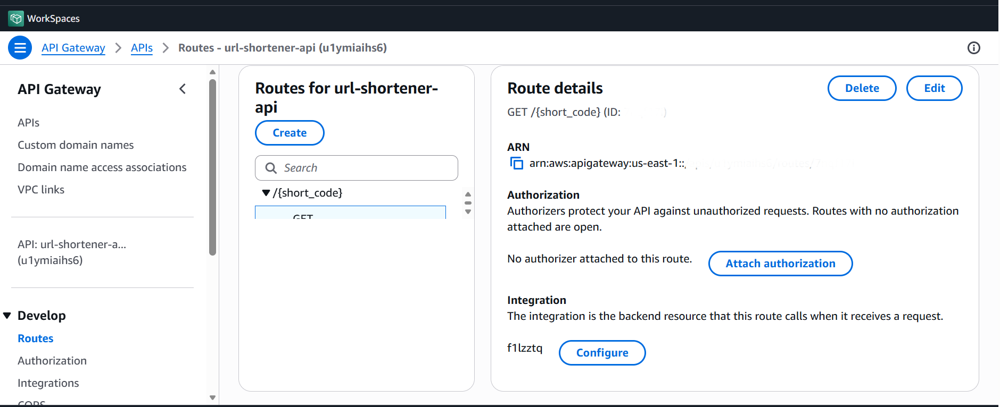
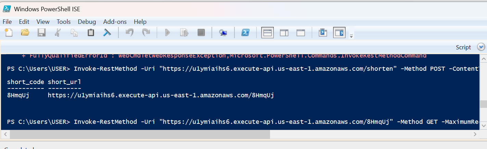
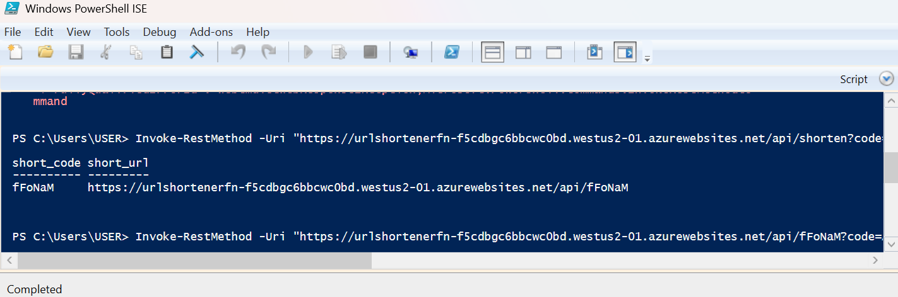
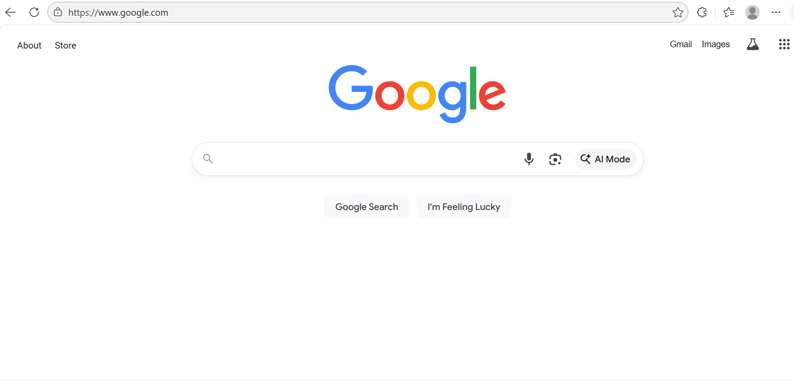
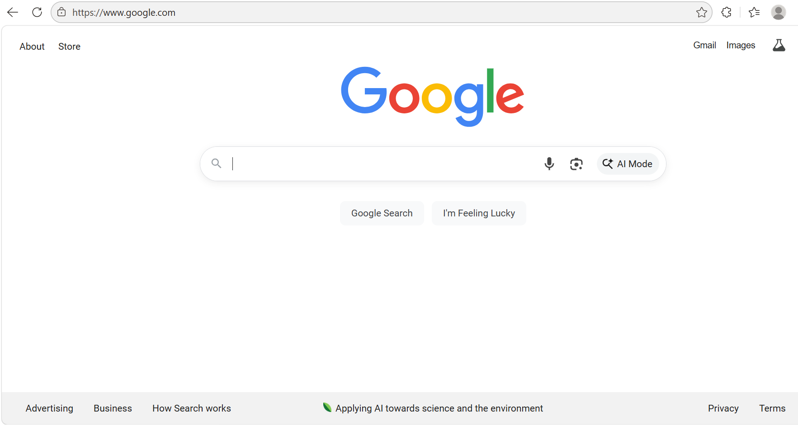

# Serverless URL Shortener

A URL shortener deployed on both AWS and Azure using serverless architecture.
Send a long URL, get a short code back. Hit the short code, get redirected.
Built this to understand how the same problem is solved differently across two cloud providers.

## How it works

```
POST /shorten      →  { "long_url": "https://..." }  →  { "short_code": "8HmqUj" }
GET /{short_code}  →  301 redirect to original URL
```

## Architecture



### AWS
```
Client → API Gateway → Lambda → DynamoDB
```

| Service | Resource | Region |
|---|---|---|
| Compute | AWS Lambda (`url-shortener`) | us-east-1 |
| Database | DynamoDB (`url-shortener`) | us-east-1 |
| API | API Gateway (`url-shortener-api`) | us-east-1 |

### Azure
```
Client → Azure Functions → Cosmos DB
```

| Service | Resource | Region |
|---|---|---|
| Compute | Azure Functions (`urlshortenerfn`) | West US 2 |
| Database | Cosmos DB (`url-shortener-cos`) | West US 2 |

## AWS vs Azure

| | AWS | Azure |
|---|---|---|
| Function compute | Lambda | Azure Functions |
| NoSQL database | DynamoDB | Cosmos DB |
| API layer | API Gateway (HTTP API) | Built into Functions |
| Auth | IAM Role + Policy | Function App Keys |
| Deployment | AWS Console + zip upload | Azure CLI (`func publish`) |

## Endpoints

**AWS**
```
POST https://u1ymiaihs6.execute-api.us-east-1.amazonaws.com/shorten
GET  https://u1ymiaihs6.execute-api.us-east-1.amazonaws.com/{short_code}
```

**Azure**
```
POST https://urlshortenerfn-f5cdbgc6bbcwc0bd.westus2-01.azurewebsites.net/api/shorten
GET  https://urlshortenerfn-f5cdbgc6bbcwc0bd.westus2-01.azurewebsites.net/api/{short_code}
```

## Test it yourself

```bash
# AWS
curl -X POST https://u1ymiaihs6.execute-api.us-east-1.amazonaws.com/shorten \
  -H "Content-Type: application/json" \
  -d '{"long_url": "https://www.google.com"}'

# Azure
curl -X POST "https://urlshortenerfn-f5cdbgc6bbcwc0bd.westus2-01.azurewebsites.net/api/shorten" \
  -H "Content-Type: application/json" \
  -d '{"long_url": "https://www.google.com"}'
```

## Screenshots

| Step | AWS | Azure |
|---|---|---|
| Database |  |  |
| Function |  |  |
| API routes |  | — |
| Shorten test |  |  |
| Redirect test |  |  |

## Cost

| Service | Free Tier | Our Usage |
|---|---|---|
| AWS Lambda | 1M requests/month | ~50 test requests |
| DynamoDB | 25GB storage | < 1MB |
| API Gateway | 1M calls/month | ~50 test calls |
| Azure Functions | 1M executions/month | ~50 test requests |
| Cosmos DB | Serverless, pay per RU | < $0.01 |

**Total cost: $0**

## Repo structure

```
serverless-url-shortener/
├── aws/
│   └── lambda_function.py
├── azure/
│   └── function_app.py
├── docs/
│   └── screenshots/
│       ├── aws/
│       └── azure/
└── README.md
```